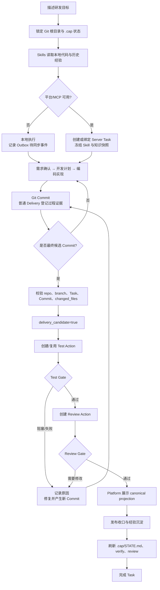

# Capital Agent 研发流程总览

这套流程把三类事实分开保存：本地 Skills 负责“现在该做什么”，Server 负责“哪个 Commit 被接受为交付证据”，Platform 负责“把任务、阻塞和人工动作展示出来”。三者通过 Task、Session、Delivery 和 Harness Action 的 ID 关联，但不能互相冒充。

## 端到端流程

## 三层状态怎么读

| 状态 | 真正来源 | 可以回答的问题 | 不能推断的结论 |
|---|---|---|---|
| `localExecution`（本地执行） | 当前仓库 `.cap/STATE.md` | 本地下一步、工作区、Outbox 是否待同步 | 不能证明 Server Gate 已通过 |
| `serverDelivery`（服务端交付） | Server Unified Task | Server 已收到哪个仓库、分支和 Commit | 不能代替 Test/Review Action 结果 |
| `serverAction`（服务端验证动作） | Server Harness Action | 精确 Commit 的测试/评审是否完成 | 不能修改本地代码或替本地 Commit |
| Platform 页面 | Server canonical projection | 人工查看、处理阻塞和触发动作 | 不能从页面缓存反推最新 Git 状态 |

### 关键身份

一次交付必须同时绑定：`repo_url + branch + task_id + commit_sha`。`idempotency_key` 也要包含这组身份。普通 Commit 只登记过程；只有最终候选 Commit 才能进入 Test → Review。任何新 Commit 都会让旧候选的验证结果失效，必须重新验证。

## 各阶段的最短判断

1. **需求确认**：`.cap/task-context.md` 已由当前代码事实刷新，需求边界和仓库身份一致。
2. **开发计划**：计划中的文件范围与实际改动一致，旧脏文件已经归属清楚。
3. **编码实现**：代码通过本地命令并形成 Git Commit；不要把本地命令结果写成 Server Gate。
4. **测试验证**：只认绑定精确 Commit 的 Test Action；Provider 不可用时记录 `ENV_BLOCKED`。
5. **代码评审**：只读 Review Action；需要修改时创建独立 Patch Action，修复产生新 Commit。
6. **发布上线**：Task 的必要 Gate 全部通过，且 `.cap/STATE.md`、验证报告和交付记录互相一致。

## 当前范围边界

Platform 的 Task 删除/审计、Bridge Token、Action 权限和 Provider Lease 仍是后续专项。本流程文档只定义它们周围的状态边界，不把暂缓项宣称为已完成。
